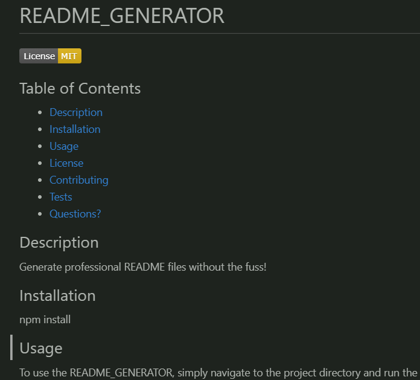
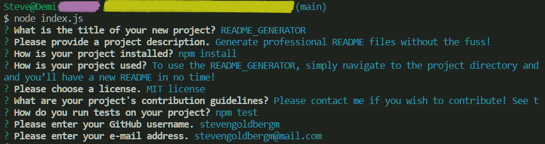

  # README_GENERATOR

  

  ## Table of Contents
  * [Description](#description)
  * [Installation](#installation)
  * [Usage](#usage)
  * [License](#license)
  * [Contributing](#contributing)
  * [Tests](#tests)
  * [Questions?](#questions)

  ## Description

  The README GENERATOR creates professional README files without the fuss! 
  
  More specifically, it's is a console application that uses NODE.JS to guide the user through creating a README file.

  

  ## Installation

  Once the repository is cloned, install the npm packages using the following command.

    npm install

  ## Usage

  To use the README_GENERATOR, simply navigate to the project directory and run the ‘node index.js’ command in your terminal. 
  
  Once you've answered the prompts, you’ll have a new README file!

  

  
  ## License
  
  

  This project uses the MIT license.

  Click the badge to access the full license details.
  

  ## Contributing

  Please contact me if you wish to contribute! See the Questions section for my contact info.

  ## Tests

  Follow the below steps to test the program. . . maybe. I won't lie - I don't know how to test yet.

    npm test

  ## Questions

  For more information, feel free to contact me:

  E-mail: [stevengoldbergm@mailPlaceholder.com](mailto:stevengoldbergm@mailPlaceholder.com)

  GitHub: [github.com/stevengoldbergm](https://github.com/stevengoldbergm)
  